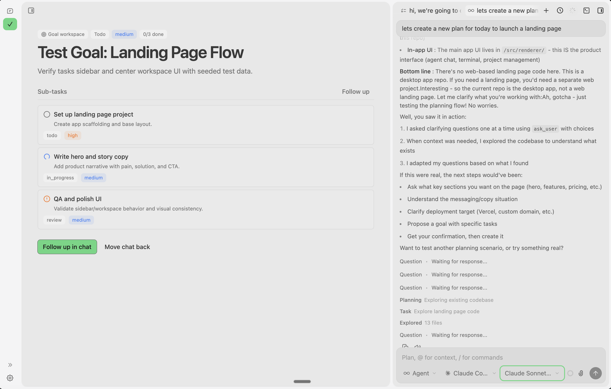

# IMI

AI ops workspace for technical product teams, with local and remote agent execution.



## Features

- **Plan & Agent Modes** - Read-only analysis or full code execution permissions
- **Project Management** - Link local folders with automatic Git remote detection
- **Real-time Tool Execution** - See bash commands, file edits, and web searches as they happen
- **Git Worktree Isolation** - Each chat session runs in its own isolated worktree
- **Integrated Terminal** - Full terminal access within the app
- **Change Tracking** - Visual diffs and PR management

## Next

Next: AI Agent Builder Mode for consistent workflows and automation co-workers in-app, closing the product loop end-to-end.

## Installation

### Option 1: Build from source (free)

```bash
# Prerequisites: Bun, Python, Xcode Command Line Tools (macOS)
bun install
bun run build
bun run package:mac  # or package:win, package:linux
```

### Option 2: Download beta builds

Get the latest beta build from [GitHub Releases](https://github.com/ProjectAI00/ai-imi/releases).

## Development

```bash
bun install
bun run dev
```

## Contributing

We welcome contributions from the community.

1. Fork this repository
2. Create a feature branch
3. Open a pull request with a clear description

## Feedback & Community

Join our [Discord](https://discord.gg/8ektTZGnj4) for support and discussions.

## License

Apache License 2.0 - see [LICENSE](LICENSE) for details.
